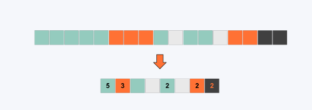

## Multimedia

<code>Multimedia este orice combinatie de text, imagine, video, sunet si animatie, accesibila utilizatorilor printr-un sistem de calcul</code>

Multimedia este posibila prin:

- Conversia analog - digital
- Compresia datelor

## Conversia analog - digital

Resursele digitale pentru conversia in format digital sunt:

- Stocarea
- Procesarea
- Includerea in aplicatii

**Important**: Resursele sunt convertite in analog (care poate fi interpretat de om) la redare

## Compresia

Avem doua tipuri de compresie:

- Lossless (fara pierderi)
- Lossy (cu pierderi)

<i>Algoritmii de compresie sunt de regula asimetrici</i> => <code>Timpul de compresie este mai mare decat timpul de decompresie</code>

### Compresia lossless

Foloseste o codificare eficienta pentru <code>reducerea dimensiunii fisierului pastrand datele originale.</code>

**Ex:** **Run Lenght Encoding (RLE):**

- O strategie simpla de realizarea a compresiei
- Poate fi folosita pentru a comprima fisiere de imagine bitmap (*pcx)
- RLE semnalizeaza cati biti la rand au acelasi cod de culoare. Practic, spune computerului sa repete o coloare pentru un numar dat de biti
- **Ex**: alb, alb, alb, alb, negru, alb, rosu, rosu, negru, negru
- **RLE**: 4 alb, 1 negru, 1 alb, 2 rosu, 2 negru

### Compresia Lossy

<code>Numarul de biti din fisierul original este redus si unele date se pierd</code>

**NU** este o optiune pentru fisierle text si pentru numere (informatii alphanumerice), deoarece pierderea unui caracter poate duce la schimbarea semnificatiei datelor

**Da:** Este posibil sa se mentina imagini sau sunete de inalta calitate cu mai putine date decat erau prezente initial. Exploateaza limitele perceptiei umane

**Ex:** **JPEG**

- Utilizata pentru imagini

**Ex:** **MPEG**

- Utilizata pentru sunete si video

**Ex:** **MP3**

- Elimina datele care nu sunt critice pentru o redare de inalta calitate
- Mai exact, elimina **secventele care nu sunt percepute de auzul uman**. Daca doua sunete sunt rulate **in acelasi timp elimina sunetul mai putin perceptibil**

## Aplicatii Multimedia

Caracteristici:

- Componentele sunt accesbilite printr-un sistem de calcul

- Datele utilizate sunt intr-un format digital (NU analog)

- Elementele sistemului sunt integrate intr-o interfata unitara

- Are grad ridicat de interactiune cu utilizatorul

**Procesul de utilizare al datelor:**

1.	**Compresie**: Datele multimedia, cum ar fi audio sau video, sunt stocate în format digital și sunt deseori comprimate pentru a reduce dimensiunea fișierului și a eficientiza transmisia. Algoritmi precum MP3 pentru audio sau H.264 pentru video sunt exemple de metode de compresie.

2.	**Decompresie**: **În timpul redării**, aceste date comprimate sunt decompresate de către un codec (un algoritm de compresie-decompresie) pentru a reveni la o formă digitală utilizabilă de playerul multimedia.
	
3.	**Conversie digital-analog**: După decompresie, datele digitale trebuie să fie transformate într-un semnal analogic pentru a fi percepute de utilizator. Aceasta este etapa în care se folosește un convertor digital-analog (DAC). De exemplu:
	
    &emsp; • Pentru audio: Datele digitale sunt convertite în semnale analogice care sunt apoi transmise la difuzoare pentru a produce sunet.
	
    &emsp; • Pentru video: Datele digitale sunt transformate în semnale electrice care controlează pixeli de pe ecran pentru a reda imaginea.

## Abordari pentru construirea de aplicatii multimedia

**1. Multimedia authoring (high-level):**

- Foloseste componente preprogramate pentru recunoasterea mai multor formate de resurse media

- Accentul cade pe scenariul de derurale a aplicatiei si pe sincronizarea resurselor

- Baza pe axa timpului, carte, diagrama de flux

- **Ex:** Flash, PowerPoint

**2. Multimedia programming (low-level):**

- Accentul cade pe procesarea directa a resurselor prin folosirea unui limbajt de programare (C, C#, JS, Java) sau a unor biblioteci

### Clasificarea aplicatiilor multimedia

Criterii:

- Domeniu: economie, educatie, publicitate, medicina, industrie, divertisment, etc

- Interactivitate: interactiv, static

- Localizarea componentelor: local, la distanta (video streaming, distant learning)