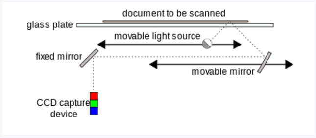

# Preconditii Hardware / Software

## Preconditii Hardware

**Dispozitive Periferice - Imagine:**

- Scanner:

&emsp;&emsp;&emsp; - Informatie luminoasa &rarr; Informatie electronica / digitala

&emsp;&emsp;&emsp; - Tipuri: flatbed / rotativ

&emsp;&emsp;&emsp; - Lumina scanner-ului se reflecta intr-un senzor CCD. 

&emsp;&emsp;&emsp;&emsp;&emsp; -Senzorul CCD este un dispozitiv care capteaza semnal analogic si convertit in semnal digital de ADC si tranferat catre RAM prin intermediul unei interfete

&emsp;&emsp;&emsp; - Recunoasterea caracterelor &rarr; OCR

- Camere foto

&emsp;&emsp;&emsp; - Lumina trece prin obiectivul camerei `=>` Imaginea este focalizata pe un CCD `=>` Genereaza semnal analogic `=>` Convertit in semnal digital de un ADC `=>` Trimis la DSP (prcesor de semnal digital) care stocheaza in memoria camerei / pe un card de memorie

**Dispozitive Periferice - Sunet:**

- Placa de sunet

&emsp;&emsp;&emsp; - Semnal analogic &rarr; Reprezentare digitalac &rarr; Pentru a putea fi redata de difuzoare

**Dispozitive Periferice - Video:**

- Placa Video

- Camera Video Digitala

## Precodintii Software

- **Drivere**

&emsp;&emsp;&emsp; - Program de computere care controleaza un anumit tip de dispozitiv, atasat la computer

&emsp;&emsp;&emsp; - Ofera o interfata software pentru dispozitivele hardware

&emsp;&emsp;&emsp; - Abstractizeaza hardware-ul pentru a putea fi folosit de OS-ul computerului fara detalii precise despre hardware-ul utilizat

- **Extensii ale OS:**

&emsp;&emsp;&emsp; - Biblioteci

&emsp;&emsp;&emsp; - Instrumente de baza pentru redarea continutului (Groove Music)

### Software Specializat

Tipuri de software pentru dezvoltarea multimedia:

- **Media-specific applications**: sunt folosite pentru a crea si edita elemente media inviduale (text, grafica, sunet, video, etc) - Ex: Word, Photoshop, After Effects

- **Authoring applications**: folosite pentru integrarea componentelor media si furnizarea de interfete cu utilizatorul - Ex: Unity

- **Grafica:**

&emsp;&emsp;&emsp; - Achizitia si prelucrare de imagini 2D sau 3D

&emsp;&emsp;&emsp; - Categorii: prelucrarea imagini raster, prelucrarea imagini vectoriale, 2D / 3D

### Aplicatii pentru prelucrarea imaginilor raster

**Imagini raster = imagini digitale formate din pixeli**

Aplicatii pentru prelucrarea imaginilor raster:

- contin seturi de instrumente pentru a crea obiecte grafice / editarea de fotografii digitale / imagini scanate

- ofera: filter, optiuni de editare a imaginii, efecte

- se bazeaza e **layers** + **seturi de maca** &rarr; contol asupra elementelor individuale ale imaginii

- **Exemple**: Photoshop, Gimp

### Aplicatii pentru prelucrarea imaginilor vectoriale

Contin:

- un set distinct de instrumente pentru crearea de forme de baza: ovale, dreptunghiuri, curbe, etc. 

- produc grafice care pot fi redimensionate cu usurinta pentru proiecte multimedia complexe

- Ex: Illustrator, Draw, etc

### Aplicatii pentru prelucrarea imaginilor 3D

- folosite pentru modelarea 3D &rarr; definirea suprafetelor, compunerea scenelor + exportarea

Etape:

- **Modelling**: se defineste obiectul &rarr; **Surface definition**: se aplica culoarea si textura &rarr; **Scene composition**: obiectele sunt aranjate in cadru, luminate, se adauga fundal si efecte special &rarr; **Rendering**: se creeaza imaginea pornind de la o scena 3D (processor intensive & time consuming)

- Ex: Blender

### Sunet

Tipuri:

- Sunet esantionat (sampled)

&emsp;&emsp;&emsp; - reprezentari digitale ale surselor de sunet analogice preluate de la microfon / alte dispozitive

&emsp;&emsp;&emsp; - usor editabile / cu multe optiuni de editare

- Sunet sintetizat (synthesized)

&emsp;&emsp;&emsp; - aplicatiile dedicate folosesc coemnzi digitale pentru a genera sunete

&emsp;&emsp;&emsp; - comenzile sunt preluate de un MIDI (tastatura) sau create intr-un program specializat

### Video

- mutarea, inserarea de video pe o axa a timpului pentru a face cut-uri, edituri, tranzitii, sincroane, etc

### Animatie

**Animatia** = tehnica utilizarii unei serii de imagini statice afisate rapid pentru a crea iluzia de miscare

- fiecare cadru reprezinta o singura instanta a secventei animate

- obiectele sunt pe o axa a timpului

### Software pentru dezvoltarea multimedia

- Folsoite pentru combinarea elementelor media, sincronizarea continutului si pentru proiectarea intervetei cu utilizatorul

**Categorii**

- Card - based

&emsp;&emsp;&emsp; - elementele sunt asezate la fel precum paginile unei carti

&emsp;&emsp;&emsp; - Ex: PowerPoint

- Timeline

&emsp;&emsp;&emsp; - compus din cadre similar filmului

&emsp;&emsp;&emsp; - ofera control precis pentru animatii avansate

&emsp;&emsp;&emsp; - Ex: Director, Animate

- Diagrama de flux

&emsp;&emsp;&emsp; - Pe baza unei diagrame sunt dezvoltate produse multimedia

&emsp;&emsp;&emsp; - Authoware
