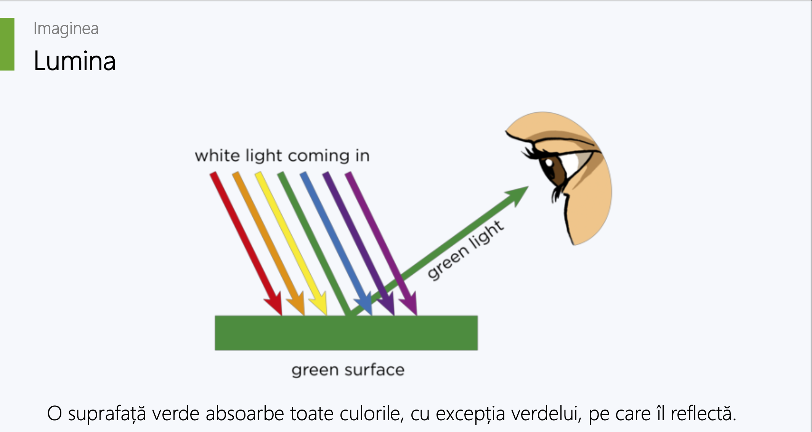
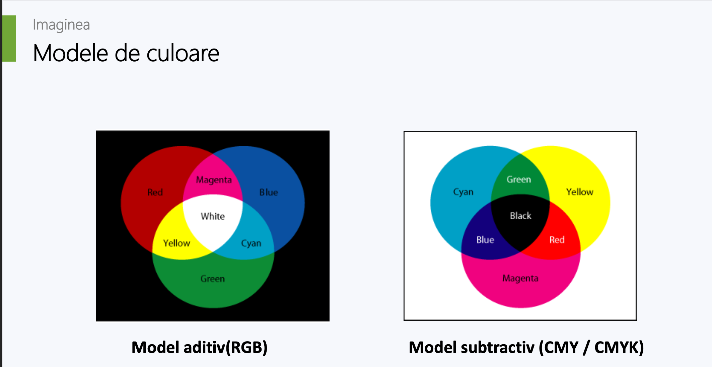
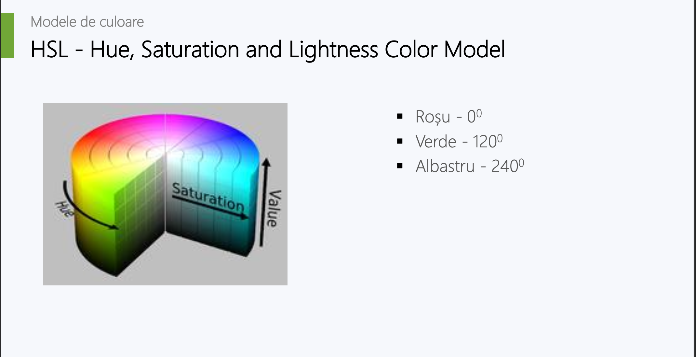

# Culori

Culorile primare și secundare ale luminii albe devin vizibile atunci când sunt
refractate de o prismă de sticlă.

**Observatie**: Culoarea alba reflecta toate culorile

### Modele de culoare

### Modelul aditiv

- În modelele aditive culorile sunt create prin amestecarea mai multor culori
primare.

- Cele mai des utilizate culori primare sunt rosu, verde si albastru

- Modelul aditiv pornește de la negru și ajunge la alb; pe măsură ce se adaugă
mai multă culoare, rezultatul este mai deschis și tinde spre alb.

- Combinarea a două dintre cele trei culori primare standard utilizate în modelul
aditiv în proporții egale produce una dintre culorile secundare din modelul aditiv
    - cian, magenta sau galben

### Modelul RGB

- Utilizează culorile de bază roșu, verde și albastru (RGB).

- Reglând intensitatea fiecărei culori se pot obține toate culorile din spectrul luminii
vizibile. Se va obține culoarea albă prin combinarea culorilor de bază în mod
egal.

- Dacă ar fi să ne uităm la un monitor LCD (ecran cu cristale lichide) la microscop,
am vedea că fiecare pixel afișează în realitate doar cele trei culori primare ale
luminii.

### HSL - Hue, Saturation and Lightness Color Model

### Modele substractive

- Combinarea culorilor în procesul de imprimare utilizează metoda substractivă

- Modelul substractiv explică cum este posibil ca prin combinarea unui număr
limitat de pigmenți sau coloranți naturali să se obțină o paletă largă de culori.
Adăugarea fiecărei culori determină reducerea parțială sau completă (absorbția)
unor lungimi de undă a luminii (și reflectarea celorlalte)

### Modelul CMYK

- Modelul de culoare CMYK este utilizat în
procesul de imprimare

- CMYK se referă la cele patru cerneluri utilizate în
majoritatea imprimărilor color: cyan, magenta,
yellow și key (black)

