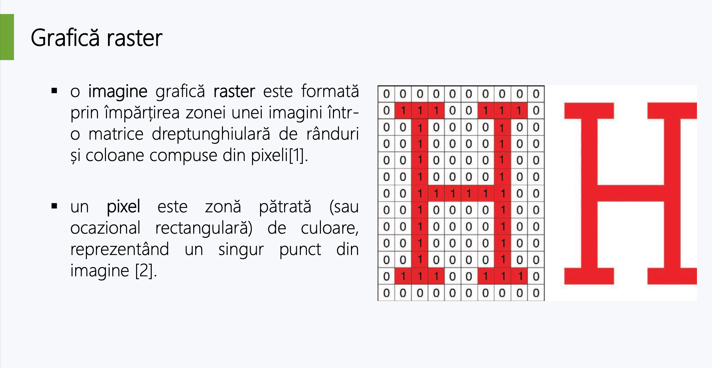
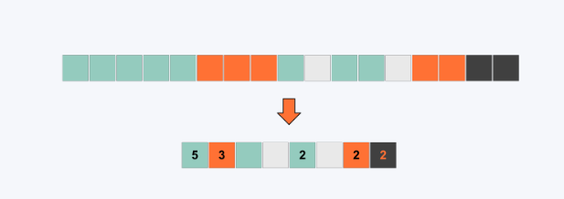

# Imaginea

- Calculatoarele pot fi utilizate pentru a crea imagini 2D (lățime și înălțime) sau 3D
(lățime, înălțime și adâncime)

### Grafica 2D

1. Bitmap: potrivită pentru imagini cu detalii fine, cum ar fi picturi sau fotografii.
Numită și grafică raster. Stochează informația despre culoarea fiecărui pixel

2. Vectorială: utilizat pentru desene grafice, de la desene și logo-uri simple la
creații artistice sofisticate. Utilizează descrieri matematice

### Grafica raster

- O imagine este o reprezentare bidimensională sau tridimensională a unei
persoane, obiect sau scenă din lumea naturală.

- O imagine digitală este o reprezentare numerică a unei imagini bidimensionale.



**Observatie**: Putem considera grafica raster asemanatoarea cu un mozaic

#### Formate 

1. PNG 

    - cel mai utilizat format de compresie a imaginilor fără pierderi de pe Internet

    - creat ca un înlocuitor îmbunătățit, nebrevetat, pentru formatul GIF

    - permite afișarea a 16.8 million colors; suportă transparență; permite utilizarea unui număr mai mic de culori pentru a reduce dimensiunea fișierului (PNG 8, sau PNG cu reprezentarea culorilor pe 8-biți) [2]

    - format de compresie fără pierderi

    - utilizat pentru o gamă largă de imagini, inclusiv favicons (the small web page icons in browser tabs) 

    - fișierele PNG pot fi foarte mici, dar pentru fotografii cu multe culori, pot avea o dimensiune mai mare decât fișierele JPEG la o calitate comparabilă

2. WebP

    - acceptă compresia cu pierderi prin codificare predictivă bazată pe codecul video VP8 și compresia fără pierderi care folosește substituții pentru repetarea datelor

    - imaginile WebP cu pierderi sunt în medie cu 25–35% mai mici decât imaginile JPEG cu niveluri de compresie similare vizual. Imaginile WebP fără pierderi sunt sde obicei cu 26% mai mici decât aceleași imagini în format PNG

    - permite redarea de animații

#### Algoritmi de compresie

1. Run Length Encoding - RLE



2. Lempel–Ziv–Welch (LZW)

    - Algoritm fara pierdere de informatii

    - Encoding

        - Initialize the dictionary to contain all strings of length one.

        - Find the longest string W in the dictionary that matches the current input.

        - Emit the dictionary index for W to output and remove W from the input.

        - Add W followed by the next symbol in the input to the dictionary.

        - Go to Step 2.

3. JPEG Compression

    - Algoritm cu pierdere de informatii

    - Steps

       1. color space transformation
        
        2. downsampling

        3. block splitting

        4. transformation

        5. quantization

        6. encoding

```html
    
```