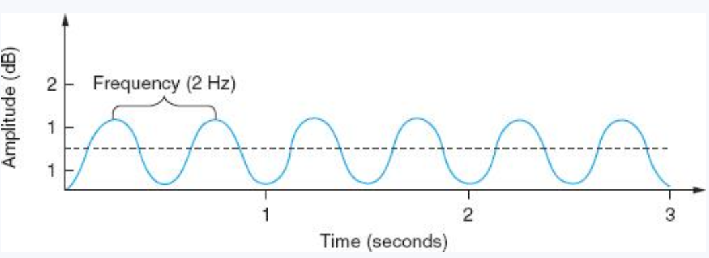

## Sunetul

- Sunetul este o vibrație propagată printr-un mediu material sub forma unei unde
mecanice.

- Urechea umană poate percepe sunete cu frecvența cuprinsă între aproximativ 20
Hz și 20 kHz

### Caracteristicile sunetului:

1. Amplitudinea

    - este o măsură a presiunii sonore sau a cantității de energie
asociată sunetului. Aceasta este reprezentată de verticală sau axa y a undei
sinusoidale. Amplitudinea este percepută ca volum al sunetului, care este de
obicei măsurat în decibeli (dB).

2. Frecvența

    - este numărul de repetări ale unei forme de undă într-un anumit
interval de timp. Este reprezentată pe axa orizontală ca distanță între două
vârfuri de undă sau jgheaburi. Frecvența este măsurată în hertz (Hz).

3. Durata sunetului

**Există două tipuri majore de sunet digital:**

- eșantionat

-  sintetizat.

**Sunetul sintetizat** este un sunet generat (sau sintetizat) de computer. Un fișier
pentru sunetul sintetizat conține instrucțiuni pe care computerul le folosește
pentru a produce sunetul.

**Sunetul eșantionat** este de obicei utilizat pentru a capta și edita sunete naturale,
cum ar fi vorbirea umană, spectacole muzicale și dramatice, ciripit de păsări,
lansări de rachete și așa mai departe. Sunetul sintetizat este utilizat în general
pentru a crea compoziții muzicale originale sau pentru a produce efecte sonore
noi.

- este o înregistrare digitală a undelor sonore analogice
existente anterior. Un fișier pentru sunetul eșantionat conține multe mii de valori
numerice, fiecare dintre acestea fiind o înregistrare a amplitudinii undei sonore la
un moment particular, o eșantionare a sunetului.

## Numerizarea sunetului

- Presupune stocarea și prelucrarea sunetului în format digital

- Sunetul este captat prin înregistrarea a numeroase măsurători separate ale
amplitudinii unei unde utilizând un convertor ADC sau analog-digital. Un
dispozitiv analogic, cum ar fi un microfon sau amplificatorul dintr-un sistem de
difuzoare, generează un model de tensiune care variază continuu pentru a se
potrivi cu unda sonoră originală. ADC eșantionează aceste tensiuni de mii de ori
pe secundă. Aceste valori digitale sunt apoi utilizate pentru a recrea sunetul
original prin conversia informațiilor digitale înapoi într-o formă analogică
utilizând un convertor DAC sau digital-analog. DAC utilizează valorile
amplitudinii pentru a genera variații de tensiune în curentul care alimentează
difuzoarele pentru a reproduce sunetul

Etape:

- Convertirea sunetului în semnal electric (micofon)

- Eșantionarea și cuantificarea semnalului (ADC)

- Stocarea informației numerice pe un suport de memorie externă conform unui
format